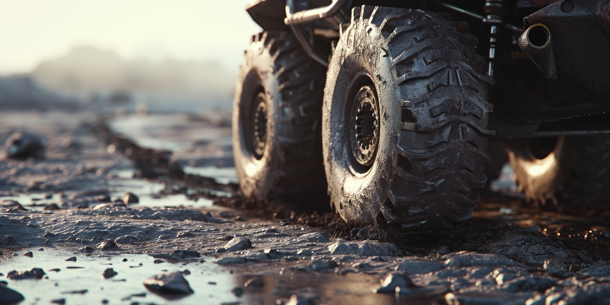

# I Have Good Wheels, You Know: Sticking to What Works

You know, I've mentioned this quite a few times before, but I'm like this old dog who tends to overthink everything 😄 I really do read into things a lot.

But here's my take on wheels—yep, I'm talking about wheels.

In life, and particularly in coding, nobody wants to reinvent the wheel. Coders love to stick to what's already there; that's the whole point of wheels, isn't it?

Our rule is pretty simple: if it ain't broke, don't fix it.

We only step away from this when we see that the existing wheels just don't cut it. They might be broken, not good enough, or just not right for what we need. Then, and only then, do we get into the whole cycle of reinventing the wheel, doing it over and over until we get it just right.

So, if you've got some newfangled idea for a better wheel, you really have to sell it to us. We're the ones who are going to use them, after all.

And let's not forget, we're also the ones who'll be footing the bill.

If we don't see a good reason to switch, we just won't. We'll stick to our old wheels, no matter how much you try to push the new ones on us.

Honestly, if we've got wheels that work just fine, we're not in the market for new ones. We'd rather find new roads to explore.

Better wheels? If they're so great, why aren't you using them yourself? That's what I'd wonder.

I might give those flashy new wheels a quick glance, but I'll always come back to my trusty old ones that work just fine.

Especially if these new wheels mean learning a whole new system, with a steep learning curve and not much benefit to show for it.

"The wheels we have aren't just good enough; they're fantastic on any terrain. That might be your selling point: the new wheels run well on your turf. But the old wheels perform just fine on all terrains, including yours." Some might argue🤗 Just saying.

Well, that would be my take on wheels, too.

"No matter how hard you pitch the new ones, if our current wheels seem too good to be replaced, I'll just stick to my Warthogs." That's what I'd say.

Just my two cents, from someone who's been on all kinds of terrain you can imagine, and even some you can't.